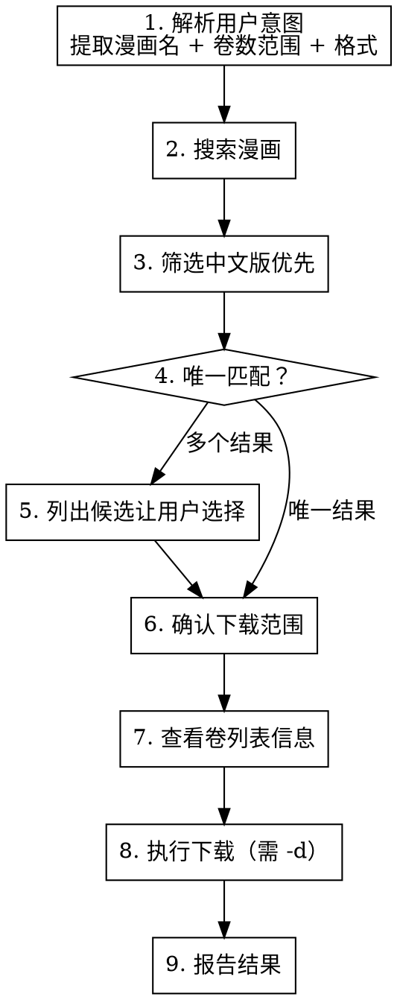

# Kmoe 漫画下载

从 koz.moe 搜索并下载漫画（mobi/epub 格式）。

## 触发条件

用户消息中包含以下任一模式：
- "下载《xxx》" / "下载漫画 xxx" / "给我下载 xxx"
- "download manga xxx"
- 提到漫画名称 + 下载/获取/拉取意图

## 工作流



## 详细步骤

### 1. 解析用户意图

从用户消息中提取：

| 信息 | 示例 | 默认值 |
|------|------|--------|
| 漫画名 | 《烙印战士》 | 必填 |
| 卷数范围 | 第5卷、1-10卷、全部 | 全部 |
| 格式 | mobi / epub | epub（优先），无 epub 时回退 mobi |
| 分类 | 單行本/話/番外篇 | 全部分类 |

识别规则：
- "第 N 卷" → 单卷 `--start N-1 --max 1`
- "第 M 到 N 卷" → 范围 `--start M-1 --max N-M+1`
- "全部" / 不指定 → `--start 0 --max 0`
- "epub" → `--type epub`
- "只下载單行本" / "單行本分类" → `--category 單行本`
- "只要话" → `--category 話`
- "番外篇" → `--category 番外篇`
- 不指定分类 → 不加 `--category`

### 2. 搜索

```bash
source $MOE_CRAW_DIR/.venv/bin/activate
python3 $MOE_CRAW_DIR/kmoe_crawler.py -s "漫画名"
```

`$MOE_CRAW_DIR` 是仓库根目录的绝对路径，用户需在 shell 配置中设置（见 README）。

脚本自动读取 config.json 中的账号密码并登录，无需手动传 cookie。

### 3. 筛选优先级

按以下顺序从搜索结果中选择候选：

1. **中文繁体版**（名称含中文、无日语/英文标签）
2. **中文简体/台版**（名称含"台版"等标记）
3. **其他语言版**（日语原版、英文版等）

排除项：
- 画集、设定集、纪念册等非正篇（除非用户明确要求）
- 评分低于 6.0 的（除非搜索结果不足）

### 4. 确认

**唯一匹配时**：直接展示信息并确认
```
找到：《烙印戰士》 三浦建太郎 [9.8分] 49卷
将下载到 ~/Downloads/，确认？(epub 格式，无 epub 时回退 mobi)
```

**多个候选时**：列出编号让用户选择
```
找到多个版本，请选择：
  [1] 烙印戰士 - 三浦建太郎 [9.8] (中文, 49卷)
  [2] 烙印勇士(台版) - 三浦建太郎 [9.8] (台版, 卷数未知)
  [3] Berserk - 三浦建太郎 [9.2] (英文, 卷数未知)
请输入编号（默认 1）：
```

### 5. 查看信息（先确认卷数再下载）

```bash
source $MOE_CRAW_DIR/.venv/bin/activate
python3 $MOE_CRAW_DIR/kmoe_crawler.py --book-url "BOOK_URL"
```

此命令仅展示书籍信息和卷列表（按分类分组显示），**不会触发下载**。用于确认总卷数和卷名后再决定下载范围。

> **重要**：`--book-url` 必须配合 `-d` 才会执行下载，单独使用仅为信息查看模式。

### 6. 执行下载

```bash
source $MOE_CRAW_DIR/.venv/bin/activate
python3 $MOE_CRAW_DIR/kmoe_crawler.py \
  --book-url "BOOK_URL" \
  -d \
  --type epub \
  --start START --max MAX \
  --delay 0.8
```

如需按分类下载（如只下载單行本）：

```bash
python3 $MOE_CRAW_DIR/kmoe_crawler.py \
  --book-url "BOOK_URL" \
  -d \
  --category 單行本
```

> **性能提示**：默认使用 20 线程并行下载。可通过 `--workers N` 调整（`--workers 1` 为单线程）。

### 7. 报告结果

下载完成后输出：
```
下载完成：《烙印戰士》
  位置：~/Downloads/烙印戰士/
  文件：卷 01.epub (117.5 MB), 卷 02.epub (137.5 MB)
  成功：2 / 失败：0
```

## 多账号与失败处理

脚本支持多账号轮换。当某个账号额度耗尽或 session 失效（403）时，自动切换到下一个账号重试。

### 下载失败时：
1. 403 / 额度不足 → 自动切换下一个账号重试同一卷
2. 所有账号耗尽 → 输出提示，停止下载
3. 下次运行时所有账号标记自动重置

### 配置文件

config.json 支持多账号格式：

```json
{
    "accounts": [
        {"email": "user1@xx.com", "passwd": "pass1"},
        {"email": "user2@xx.com", "passwd": "pass2"}
    ],
    "type": "epub",
    "delay": 1.0,
    "output": "~/Downloads"
}
```

脚本自动登录并管理 session cookie，无需手动填写。

## 常见问题

| 问题 | 处理 |
|------|------|
| 搜索无结果 | 自动登录刷新 cookie |
| 下载 403 | 自动切换下一个账号 |
| 额度不足 | 自动切换下一个账号 |
| 所有账号耗尽 | 提示用户添加更多账号 |
| 用户要求不存在的卷 | 检查卷列表后告知实际卷数范围 |
